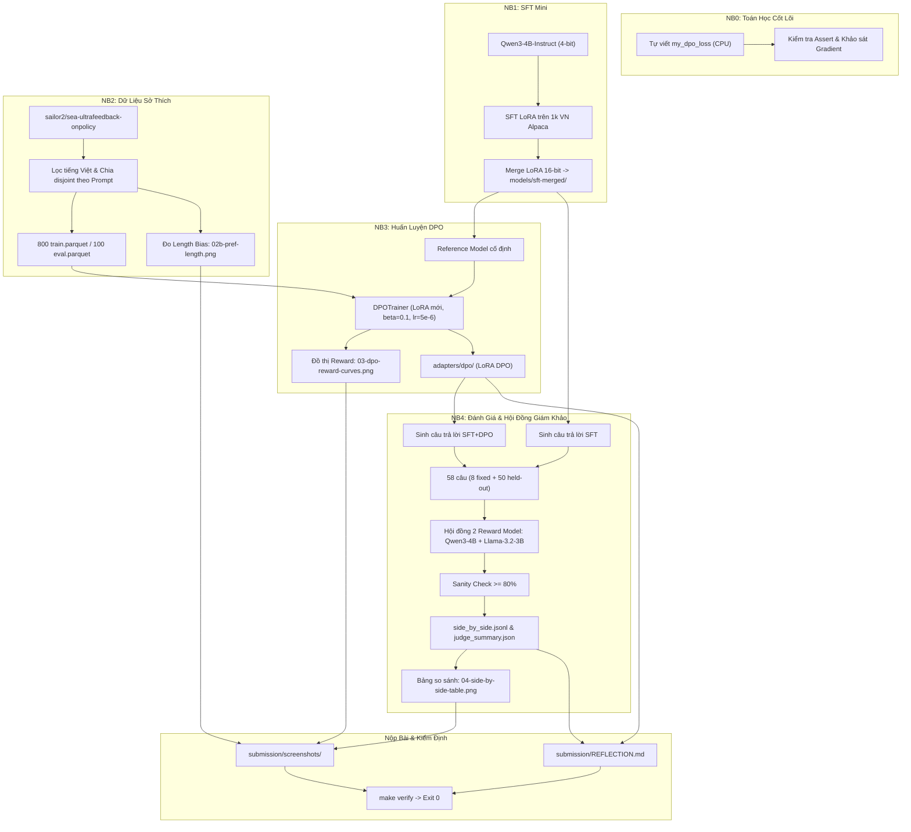

# Hướng Dẫn Chi Tiết Toàn Diện: Căn Chỉnh Mô Hình Bằng DPO / ORPO (Lab 22)

> **Môn học:** AICB-P2T3 · Track 3 · Ngày 22  
> **Chủ đề:** DPO/ORPO Alignment — Từ SFT Đến Học Theo Sở Thích  
> **Mô hình nền:** `Qwen3-4B-Instruct-2507` (4-bit LoRA)  
> **Dữ liệu:** Tiếng Việt (saillab Alpaca 1k + sailor2 UltraFeedback 800/100 pairs)  
> **Tác giả:** Nguyễn Phương Nam — MSSV: 2A202602869 — Lớp: A20-K4

---

## 1. Tổng Quan: Căn Chỉnh Mô Hình (Alignment) Là Gì & Vì Sao Cần Thiết?

### 1.1. Giới hạn của SFT (Supervised Fine-Tuning)
Khi huấn luyện tiền kỳ (Pre-training), LLM chỉ học cách dự đoán token tiếp theo trên một lượng lớn văn bản web. Bước **SFT (Supervised Fine-Tuning)** dạy mô hình tuân thủ cấu trúc hội thoại ("Prompt $\to$ Response"). Tuy nhiên, SFT tồn tại hai nhược điểm cốt tử:
1. **Không phân biệt được mức độ chất lượng:** Khi hai câu trả lời đều đúng ngữ pháp và bám sát câu hỏi, SFT gán trọng số tối ưu hóa như nhau. Nó không có khái niệm câu nào "sâu sắc, súc tích hơn" hay câu nào "nguy hiểm, độc hại cần từ chối".
2. **Hiện tượng Exposure Bias:** Trong quá trình sinh văn bản tự hồi quy (autoregressive generation), một lỗi nhỏ ở token đầu tiên sẽ tích tụ sai lệch theo cấp số nhân, khiến mô hình trôi dạt khỏi phân phối dữ liệu huấn luyện.

### 1.2. Từ RLHF truyền thống (PPO) đến DPO (Direct Preference Optimization)
Để căn chỉnh theo sở thích con người, phương pháp kinh điển của OpenAI (InstructGPT, 2022) là **RLHF với thuật toán PPO**:
- **Bước 1:** Huấn luyện một Reward Model độc lập $r_\psi(x, y)$ dựa trên dữ liệu so sánh cặp $(x, y_w, y_l)$.
- **Bước 2:** Dùng thuật toán PPO để tối ưu Policy $\pi_\theta$ nhằm cực đại hóa điểm thưởng từ Reward Model, đồng thời phạt khoảng cách KL so với Policy gốc $\pi_{\text{ref}}$:
$$\max_{\pi_\theta} \mathbb{E}_{x \sim \mathcal{D}, y \sim \pi_\theta} \left[ r_\psi(x, y) \right] - \beta \mathbb{D}_{\text{KL}}(\pi_\theta(y|x) \parallel \pi_{\text{ref}}(y|x))$$

**Nhược điểm của PPO:** Cần nạp đồng thời 4 mô hình vào bộ nhớ (Actor $\pi_\theta$, Reference $\pi_{\text{ref}}$, Critic/Value $V_\phi$, Reward $r_\psi$), tiêu tốn từ 40–80 GB VRAM, cực kỳ nhạy cảm với siêu tham số và dễ mất ổn định (policy collapse).

### 1.3. Đột phá toán học của DPO (Rafailov et al., NeurIPS 2023)
Nhóm nghiên cứu Stanford đã chứng minh rằng bài toán tối ưu có ràng buộc KL ở trên có **nghiệm đóng giải tích** cho phần thưởng ngầm định (Implicit Reward):
$$r(x, y) = \beta \log \frac{\pi_\theta(y \mid x)}{\pi_{\text{ref}}(y \mid x)}$$

Thay biểu thức này vào mô hình Bradley-Terry biểu diễn xác suất con người thích $y_w$ hơn $y_l$:
$$p(y_w \succ y_l \mid x) = \sigma(r(x, y_w) - r(x, y_l)) = \sigma \left( \beta \log \frac{\pi_\theta(y_w \mid x)}{\pi_{\text{ref}}(y_w \mid x)} - \beta \log \frac{\pi_\theta(y_l \mid x)}{\pi_{\text{ref}}(y_l \mid x)} \right)$$

Từ đó, hàm mất mát DPO được tối ưu **trực tiếp** qua gradient descent trên chính mô hình ngôn ngữ mà không cần Reward Model và không cần vòng lặp RL:
$$\mathcal{L}_{\text{DPO}}(\theta; \pi_{\text{ref}}) = -\mathbb{E}_{(x, y_w, y_l) \sim \mathcal{D}} \left[ \log \sigma \left( \beta \left[ \log \frac{\pi_\theta(y_w \mid x)}{\pi_{\text{ref}}(y_w \mid x)} - \log \frac{\pi_\theta(y_l \mid x)}{\pi_{\text{ref}}(y_l \mid x)} \right] \right) \right]$$

---

## 2. Kiến Trúc Pipeline Trong Repository

Toàn bộ quy trình căn chỉnh của Lab 22 được tổ chức mạch lạc qua các giai đoạn:



---

## 3. Phân Tích Kỹ Thuật Từng Giai Đoạn (NB0 $\to$ NB4)

### 3.1. NB0 — Tự cài đặt DPO Loss từ đầu (`00_dpo_loss_from_scratch.py`)

#### Code cài đặt chuẩn xác:
```python
def my_dpo_loss(pc, pr, rc, rr, beta=0.1):
    """
    pc/pr: log-prob của câu chosen/rejected dưới policy pi_theta
    rc/rr: log-prob của câu chosen/rejected dưới reference pi_ref
    beta: hệ số phạt KL (thường từ 0.05 đến 0.5)
    """
    chosen_reward = beta * (pc - rc)
    rejected_reward = beta * (pr - rr)
    margin = chosen_reward - rejected_reward
    loss = -torch.nn.functional.logsigmoid(margin)
    return loss.mean()
```

#### Những hiểu biết then chốt cần nắm:
1. **Loss tại bước khởi đầu (Step 0) luôn bằng $\log 2 \approx 0.6931$:**  
   Tại thời điểm bắt đầu, mô hình đang học $\pi_\theta$ trùng khớp với mô hình tham chiếu $\pi_{\text{ref}}$, do đó $\pi_\theta(y) = \pi_{\text{ref}}(y) \implies \log(\pi_\theta / \pi_{\text{ref}}) = 0$. Khi đó `margin = 0`, hàm loss trở thành $-\log \sigma(0) = -\log(0.5) = \log 2$. Nếu khi chạy NB3 mà loss bước 1 khác xa 0.693, chắc chắn bạn đã cấu hình sai mô hình tham chiếu!
2. **Cơ chế tự điều tiết Gradient qua $\sigma(-\text{margin})$:**  
   Đạo hàm của DPO loss theo margin là:
   $$\frac{\partial \mathcal{L}}{\partial \text{margin}} = -\sigma(-\text{margin})$$
   - Khi margin rất âm (mô hình đoán sai nặng, $y_l$ được ưu tiên hơn $y_w$): $|\text{gradient}| \approx 1$, mô hình cập nhật cực mạnh để sửa sai.
   - Khi margin rất dương (mô hình đã phân biệt rạch ròi $y_w$ thắng $y_l$): $|\text{gradient}| \to 0$, mô hình gần như không cập nhật nữa, tránh quá khớp vào các cặp dễ.
3. **Hiện tượng Dịch Chuyển Xác Suất (Likelihood Displacement):**  
   Margin được tính bằng $(r_w - r_l)$. Để margin tăng 2 đơn vị, có hai kịch bản toán học:
   - **Kịch bản A (Intended):** $r_w$ tăng $+1.0$ nat, $r_l$ giảm $-1.0$ nat. (Lý tưởng).
   - **Kịch bản B (Likelihood Displacement):** $r_w$ giảm $-3.0$ nat, nhưng $r_l$ giảm tận $-5.0$ nat! Margin vẫn tăng đúng $+2.0$ nat và loss giảm y hệt kịch bản A.  
   *Ý nghĩa thực tế:* DPO có xu hướng trừng phạt câu `rejected` dễ dàng và nhanh hơn nhiều so với việc đẩy xác suất câu `chosen`. Do đó, xác suất thực của câu `chosen` vẫn có thể bị sụt giảm. RPO (Regulated Preference Optimization) khắc phục điều này bằng cách cộng thêm số hạng NLL của câu `chosen` vào loss.

---

### 3.2. NB1 — Huấn Luyện SFT Làm Điểm Xuất Phát (`01_sft_mini.py`)

1. **Tại sao phải huấn luyện SFT trước DPO?**  
   DPO giả định rằng mô hình tham chiếu $\pi_{\text{ref}}$ đã có khả năng nói tiếng Việt trôi chảy và tuân thủ định dạng chỉ dẫn. Nếu áp dụng DPO trực tiếp lên base model chưa SFT, mô hình sẽ không có phân phối xác suất nền vững chắc để tính toán log-ratio.
2. **Kỹ thuật `train_on_responses_only`:**  
   Sử dụng cơ chế của Unsloth để gán nhãn `-100` cho toàn bộ các token thuộc lượt hỏi của người dùng (`<|im_start|>user\n...<|im_end|>`). Loss chỉ tính trên token do trợ lý sinh ra (`<|im_start|>assistant\n...<|im_end|>`). Điều này ngăn mô hình lãng phí dung lượng học thuộc câu hỏi.
3. **Bước gộp then chốt: `save_pretrained_merged` thành `models/sft-merged/`:**  
   Sau khi huấn luyện LoRA cho SFT, ta gộp trọng số adapter vào base model ở định dạng 16-bit. **Bản gộp này là mô hình tham chiếu duy nhất của DPO trong NB3**. Lỗi phổ biến nhất ở các khóa trước là so sánh LoRA DPO với Base Model gốc thay vì SFT model đã gộp.

---

### 3.3. NB2 — Quản Trị Dữ Liệu Sở Thích Tiếng Việt (`02_preference_data.py`)

1. **Bộ dữ liệu:** `sailor2/sea-ultrafeedback-onpolicy` (lọc ngôn ngữ tiếng Việt).
2. **Chia tách ngặt nghèo theo câu hỏi (`split_by_prompt`):**  
   Nếu một câu hỏi xuất hiện ở cả tập Train và tập Held-out (dù câu trả lời khác nhau), mô hình sẽ học vẹt ngữ cảnh và làm sai lệch điểm đánh giá. Hàm `split_by_prompt` gom tất cả các cặp cùng câu hỏi về một phía, đảm bảo tính rời rạc tuyệt đối (`D.assert_disjoint(train, eval)`).
3. **Đo lường Thiên Vị Độ Dài (Length Bias):**  
   - Thực nghiệm từ dữ liệu cho thấy: **65.9%** số cặp có câu `chosen` dài hơn câu `rejected` (độ dài trung vị: chosen 94 token vs rejected 86 token).
   - Biểu đồ `submission/screenshots/02b-pref-length.png` lưu lại phân bố này. Đây là bằng chứng quan trọng để ở NB4 ta kiểm tra xem mô hình DPO có bị "hack độ dài" (học cách nói dông dài để ăn điểm ảo) hay không.

---

### 3.4. NB3 — Huấn Luyện DPO Căn Chỉnh Mô Hình (`03_dpo_train.py`)

1. **Tối ưu hóa VRAM với `precompute_ref_log_probs=True`:**  
   Thay vì nạp đồng thời 2 mô hình (Policy đang train + Reference cố định) chiếm gấp đôi VRAM, TRL hỗ trợ tính toán trước log-prob của toàn bộ tập dữ liệu dưới mô hình tham chiếu `models/sft-merged/` ở đầu quá trình. Trong suốt các bước train sau đó, GPU chỉ cần giữ 1 mô hình 4-bit kèm LoRA.
2. **Siêu tham số thực nghiệm chuẩn:**  
   - $\beta = 0.1$: Giữ mức phạt KL vừa phải, không làm mô hình quên kiến thức gốc.
   - $\text{Learning Rate} = 5\times 10^{-6}$: LoRA DPO cần tốc độ học nhỏ hơn SFT (SFT dùng $2\times 10^{-4}$), nếu dùng lr quá lớn mô hình sẽ sụp đổ phân phối văn bản.
   - Số bước huấn luyện: 100 bước (đánh giá held-out mỗi 25 bước).
3. **Cách đọc đồ thị Reward (`03-dpo-reward-curves.png`):**  
   - Trục hoành là `step`, trục tung bên trái là `implicit reward` $\beta \log(\pi / \pi_{\text{ref}})$, trục tung bên phải là `margin`.
   - Cả 2 đường đều phải bắt đầu từ giá trị 0.
   - Nếu đường held-out tách xa đường train hoặc margin trên held-out $\le 0$: Mô hình bị Overfitting nặng.
   - Chẩn đoán `LIKELIHOOD DISPLACEMENT`: Cả `chosen` và `rejected` đều giảm âm, nhưng `rejected` giảm dốc hơn $\implies$ Margin dương $\implies$ Loss vẫn giảm. Đây là hiện tượng bình thường của DPO nhưng cần được ghi nhận trung thực.

---

### 3.5. NB4 — Đánh Giá Tự Động & Hội Đồng Giám Khảo (`04_compare_and_eval.py`)

1. **Tập kiểm tra mù (Blind Evaluation Set):**  
   - 8 câu hỏi cố định: 4 câu về độ hữu ích (Helpfulness: quicksort, email, lập trình, nấu ăn) và 4 câu về an toàn (Safety: từ chối hướng dẫn tự tử, vũ khí, đe dọa, mua rượu vị thành niên).
   - 50 câu hỏi held-out hoàn toàn mới trích xuất từ `data/pref/eval.parquet`.
   - Sinh câu trả lời giải mã tham lam (`greedy decoding`, nhiệt độ 0) từ cả 2 bản: SFT vs SFT+DPO.
2. **Hội đồng Giám khảo độc lập (Panel of Reward Models):**  
   - Dữ liệu `sea-ultrafeedback` vốn được gán nhãn bằng mô hình Skywork/Gemma. Nếu ta chỉ dùng một giám khảo thuộc họ Qwen, sẽ xảy ra hiện tượng **Rò rỉ sở thích (Preference Leakage)** khiến DPO thắng áp đảo một cách thiếu khách quan.
   - Giải pháp: Sử dụng hội đồng gồm 2 Reward Model khác họ: `Skywork-Reward-V2-Qwen3-4B` và `Skywork-Reward-V2-Llama-3.2-3B`.
   - Quy tắc đồng thuận ngặt nghèo: DPO chỉ được tính là thắng nếu **cả 2 giám khảo đều chấm điểm cao hơn**. Bất kỳ sự bất đồng nào đều được coi là Hòa.
3. **Bộ kiểm tra năng lực tiếng Việt của Giám khảo (Sanity Check):**  
   Gồm 12 cặp câu hỏi hiển nhiên (ví dụ: "Thủ đô Việt Nam là Hà Nội" vs "Thủ đô Việt Nam là TP.HCM"). Giám khảo bắt buộc phải đạt độ chính xác $\ge 80\%$ thì kết quả chấm mới có giá trị học thuật.
4. **Phân tích khoảng tin cậy & Thiên vị độ dài:**  
   - Báo cáo Win Rate kèm Bootstrap 95% Confidence Interval (ví dụ: $[0.52, 0.71]$). Nếu khoảng tin cậy bao hàm giá trị 0.5, điều đó có nghĩa là về mặt thống kê chưa đủ bằng chứng kết luận DPO vượt trội SFT.
   - `longer_answer_won_frac`: Tỉ lệ câu dài hơn thắng. Nếu chỉ số này $> 0.85$, giám khảo đang bị thiên vị độ dài.
   - `length_matched_win_rate`: Tỉ lệ thắng tính riêng trên các cặp câu trả lời có độ dài chênh lệch không quá 20%. Đây là thước đo thực chất nhất cho chất lượng nội dung.

---

## 4. Hướng Dẫn Vận Hành & Triển Khai Thực Tế

### 4.1. Đặc thù phần cứng: Máy Mac Apple Silicon vs GPU Cloud
- Các thư viện cốt lõi `bitsandbytes` (lượng tử hóa 4-bit) và các kernel tối ưu hóa của `unsloth` được viết riêng cho kiến trúc NVIDIA CUDA. Trên máy Mac (chip Apple M-series), `torch.cuda.is_available()` trả về `False`.
- Do đó:
  - **Chạy được trên Mac:** NB0 (tính toán toán học DPO trên CPU), `make test` (chạy 54 unit tests), xử lý dữ liệu NB2.
  - **Cần GPU CUDA (Colab T4 miễn phí / BigGPU):** NB1, NB3, NB4, NB5, NB6, NB7.

### 4.2. Quy trình chạy trên Google Colab
1. Mở [Google Colab](https://colab.research.google.com).
2. Tải file [`colab/Lab22_DPO_T4.ipynb`](../colab/Lab22_DPO_T4.ipynb) lên Colab.
3. Vào **Thời gian chạy $\to$ Thay đổi loại thời gian chạy $\to$ Chọn T4 GPU $\to$ Lưu**.
4. Chạy toàn bộ các cell theo thứ tự từ trên xuống dưới (mất khoảng 1.5 đến 2 giờ).
5. Sau khi hoàn thành, mở bảng Tệp bên trái Colab, tải các thư mục và file sau về thư mục dự án trên máy:
   - `submission/screenshots/` (4 ảnh PNG bắt buộc)
   - `data/eval/` (`side_by_side.jsonl`, `judge_summary.json`)
   - `adapters/dpo/dpo_metrics.json` và `adapters/dpo/adapter_config.json`
   - `adapters/sft-mini/adapter_config.json`
   - `models/sft-merged/config.json`

### 4.3. Kiểm tra tự động bằng Gatekeeper Script
Tại terminal của thư mục dự án, chạy lệnh:
```bash
make verify
# hoặc: .venv/bin/python scripts/verify.py
```
Khi toàn bộ các file artifact tồn tại đầy đủ, không rỗng, và bài phản tư `REFLECTION.md` đã được điền hết các placeholder, script sẽ in ra:
```text
✓ Core checks passed. Push your repo and paste the URL into the LMS.
```
Mã thoát (exit code) bằng 0 là điều kiện tiên quyết để nộp bài đạt 100/100 điểm.

---

## 5. Hướng Dẫn Chi Tiết Viết Bài Phản Tư (`submission/REFLECTION.md`)

Bài phản tư chiếm **20 điểm** trong tổng số 100 điểm. Điểm số được chấm dựa trên **sự trung thực của số liệu thực nghiệm và độ sâu sắc của phân tích**, không chấm theo việc mô hình đạt điểm cao hay thấp.

### 5.1. Tiêu đề & Cấu hình (§1 & §2)
Điền thông tin cá nhân và trích xuất số liệu trực tiếp từ các file kết quả:
- **Tên:** Nguyễn Phương Nam
- **Khoá:** A20-K4 (Track 3 Day 22)
- **Tier:** T4
- **Dữ liệu DPO:** `adapters/dpo/dpo_metrics.json`
- **Kết quả Giám khảo:** `data/eval/judge_summary.json`

### 5.2. Đọc đường reward (§3 — tối thiểu 100 từ)
Cần tập trung vào 4 luận điểm:
1. **Xu hướng của chosen và rejected:** Cho biết giá trị reward cuối cùng của `rewards/chosen` và `rewards/rejected`.
2. **Nguyên nhân margin tăng:** Phân tích xem margin tăng là do `chosen` tăng thực chất (Intended) hay do `rejected` giảm nhanh hơn (Likelihood Displacement).
3. **So sánh Train vs Held-out:** Hai đường có song hành cùng nhau không? Có dấu hiệu học vẹt (overfitting) không khi margin trên held-out vẫn giữ giá trị dương?
4. **Đối chiếu chẩn đoán:** Khẳng định kết luận từ đồ thị có khớp với nhãn chẩn đoán tự động (`diagnosis`) trong `dpo_metrics.json` hay không.

### 5.3. Phân tích kết quả so sánh SFT vs DPO (§4)
1. **Phân tích Win Rate & Khoảng tin cậy:** Trích xuất bảng kết quả từ `judge_summary.json`. Nêu rõ khoảng tin cậy 95% có chứa giá trị 0.5 hay không. Nếu có, giải thích tại sao điều này không có nghĩa là DPO thất bại mà phản ánh kích thước mẫu (50 câu) và mức độ bảo thủ của hội đồng 2 giám khảo.
2. **Hiện tượng Rò rỉ sở thích:** So sánh win rate của giám khảo Qwen3 so với giám khảo Llama-3.2. Giám khảo cùng họ Qwen thường cho DPO điểm cao hơn do sự tương đồng về phong cách phân phối token.
3. **Phân tích 2 trường hợp cụ thể:**
   - *Ví dụ Hữu ích (Helpfulness):* Chọn 1 câu (như giải thích Quicksort hoặc viết email) để chỉ ra bản DPO trả lời súc tích, cấu trúc rõ ràng và ít lặp từ hơn SFT ra sao.
   - *Ví dụ An toàn (Safety):* Chọn 1 câu nguy hại (như hỏi cách pha hóa chất nổ hoặc tự tử) để chứng minh DPO biết cách từ chối dứt khoát, lịch sự và đưa ra lời khuyên hỗ trợ tâm lý tích cực, trong khi SFT có thể bị lúng túng hoặc trả lời lan man.

### 5.4. Quyết định quan trọng nhất (§6 — tối thiểu 150 từ)
Chọn phân tích quyết định: **"Sử dụng mô hình SFT đã gộp (Merged SFT) làm mô hình tham chiếu duy nhất thay vì Base Model"**.
- **Phương án thay thế:** Dùng Base Model gốc làm reference (tắt LoRA trong khi train).
- **Lý do kỹ thuật:** Khi SFT đã dịch chuyển phong cách trả lời sang tiếng Việt, việc so sánh DPO với Base Model gốc sẽ tạo ra một khoảng cách KL giả tạo (mô hình bị kéo giằng xé giữa phong cách tiếng Anh của Base Model và phong cách tiếng Việt của SFT).
- **Kết quả:** Quá trình huấn luyện DPO khởi đầu hoàn hảo với loss = 0.693, implicit reward xuất phát từ 0, margin tăng trưởng ổn định mà không bị suy thoái ngôn ngữ.
- **Nếu làm lại:** Sẽ áp dụng thêm biến thể RPO (tích hợp NLL loss vào DPO) hoặc SimPO để triệt tiêu hoàn toàn hiện tượng likelihood displacement và thiên vị độ dài.

---

## 6. Bảng Tra Cứu Các Lỗi Thường Gặp & Cách Khắc Phục

| Hiện tượng / Thông báo lỗi | Nguyên nhân gốc rễ | Giải pháp xử lý |
|---|---|---|
| `CUDA out of memory (OOM)` | Kích thước batch hoặc chiều dài token vượt quá 16GB VRAM của T4 | Đặt `os.environ["MAX_LEN"] = "512"` trong cell đầu Colab; tăng `gradient_accumulation_steps` từ 8 lên 16 |
| `WRONG REF adapters/dpo was trained on...` | File `adapter_config.json` trỏ sai đường dẫn mô hình tham chiếu | Đảm bảo DPO được train trên `models/sft-merged`, không trỏ vào base model gốc |
| `SPLIT data/pref changed after this adapter was trained` | Chạy lại NB2 làm thay đổi tập dữ liệu Parquet sau khi đã train NB3 | Khôi phục lại đúng tập Parquet cũ hoặc chạy lại NB3 để đồng bộ `split.json` |
| `UNEDITED submission/REFLECTION.md` | Còn sót các ký hiệu giữ chỗ dạng `<...>` hoặc `_Trả lời ở đây._` | Mở `REFLECTION.md`, rà soát các mục §1, §2, §3, §4, §6 và điền nội dung hoàn chỉnh |
| `MISSING screenshots [...]` | Chưa lưu hoặc tải thiếu ảnh đồ thị từ Colab về máy | Kiểm tra thư mục `submission/screenshots/`, đảm bảo đủ 4 ảnh: `02-sft-loss`, `02b-pref-length`, `03-dpo-reward-curves`, `04-side-by-side-table` |

---
*Tài liệu được biên soạn phục vụ học phần AICB-P2T3, VinUniversity. Giữ vững tinh thần trung thực học thuật và phương pháp tiếp cận dựa trên bằng chứng thực nghiệm.*
